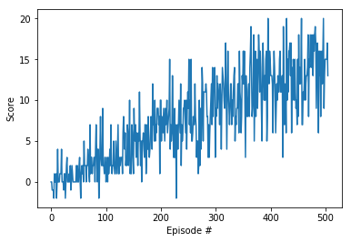

# Project 1: Navigation: Report

### 1. Introduction

For the first project of the Udacity Deep Reinforcement Class, the goal was to use Deep Q-Learning to train an agent to navigate a Banana world. In this world, there were four main entities, the agent, empty space, locations with yellow bananas, and locations with blue bananas. The agent navigated its way around the environment, and if it collected a yellow banana it received a reward of +1, and if it collected a blue banana, it received a reward of -1. The agent had four actions available to it, which were move forward, move backward, turn left, or turn right. The agent also received information abouts its current state, which consisted of the agents velocity along with a ray-based perception of objects in the agent's forward direction. By considering its current state, the agent had to decide to take one of the four available actions, and the goal of the agent is to maximize its reward.

### 2. Deep Q-Learning
Deep Q-Learning is a class of algorithms in which the optimal action value function q* is in the form of a neural network. This is unlike traditional Q-Learning, in which the optimal action value function q* is in the form of a table.

One of the major issues that is presented when a neural network is used as the optimal action value function is that the learning becomes unstable. Deep Q-Learning provides a solution to this issue by using the following two techniques:
1. Experience replay
2. Fixed Q-targets

In the case of experience replay, the agent generates an experience pool, and randomly samples from it to use for the learning. As the agent learns, the experience pool gets updated, and the agent continues randomly sampling from it.

In the case of fixed Q-targets, a slightly older version of the Q-network is used to compute the losses. This target network is kept separate from the learned network, and whereas the learned network is updated after every iteration, the target network is updated more slowly. This slower update of the target network helps stabilize the learning process.

### 3. Neural network architecture and hyperparameters
The input to the neural network was the current state of the agent, which had a dimension of 37. The neural network had 3 layers, which each layer being fully connected. The details of the layers are as follows:
- Layer 1: Fully connected - 37 dimension input, 64 dimension output, Relu activation function
- Layer 2: Fully connected - 64 dimension input, 64 dimension output, Relu activation function
- Layer 3: Fully connected - 64 dimension input, 4 dimension output

For the output layer, an element-wise mean squared error loss was used to make the updated to the weights of the network.

Apart from this, the hyperparameters that were used were as follows:
- Buffer size: 10,000
- Batch size: 64
- Discouting factor: 0.99
- Learning rate: 5e-4
- Update every: 4
- Maximum number of episodes: 2000
- Epsilon start: 1
- Epsilon end: 0.01
- Epsilon decay: 0.995

### 4. Results
A few different training sessions were run to train the agent. Initially, the goal was to stop training and consider the environment "solved" once the agent got an average reward of 13 over 100 consecutive episodes. Using the hyperparameters listed in the previous section, the agent was able to solve the environment in 405 episodes. The table below provides the results of this learning.

### 5. Discussion of results
The linked video below shows a trained agent running in the environment. This agent was trained to an average score of 13. As can be seen in the video, this agent does an amazing job. Although this is not shown in the video, the agent accumulates a reward of 24 in the episode which is excellent.  

In the next linked video below, I have the same agent as previously, but the agent does not do a very good job. In fact, the agent collects some reward at the beginning, but then gets stuck in a state where it continuously keeps on taking a "move left" action followed by a "move right" action, and gets stuck in an infinite loop. The agent only accumulates a reward of 3 in this episode.  

For the agent represented in the two videos above, I actually saw a phenomena where the agent very easily got stuck in an infinite loop similar to the one represented in the second video, and would accumulate a very small reward.

To try to find a solution for this, I decided to let the agent train longer, and the checkpoint was saved only if the agent accumulated a reward of 17 over 100 consecutive episodes. This agent was trained in about 1700 episodes (using the same hyperparameters as above), and one run of this agent is shown in the video below. In the episode shown below, the agent accumulates a reward of 17.  

For this second trained agent, it was actually noticable that the agent did a much better job in taking actions, and very rarely got stuck in infinite loops (although this was still observed a couple of times). By and large this longer training stabilized the agent, and a solution is proposed in the next section for the rate occasions in which the agent still got stuck in an infinite loop.

To try to obtain an agent that did an even better job than the reward 17 agent, it was tried to run the training for a full 2000 episodes using the same hyperparameters listed above. However, this did not result in a better agent, in fact, in all of those cases where the training was run for a full 2000 episodes, the agent at the end ended up being much worse than the agent obtained with early-stopping. This also validated the fact the early-stopping is a valid technique, and sometimes it is difficult to get a neural network back to the optimal solution once it has passed it considerably.

### 6. Proposed Improvements
In the literature, there are several improvements suggested for Deep Q-Learning that are known to improve the learning of Deep Q-Learning. Due to the infinite loop phenomena that was experienced in my trained agents, I propose that implementing a prioritized experience replay could lead to a considerably better agent. If prioritized experience replay is used, the replay buffer is no longer sampled randomly, but a priority is used based on the error that was obtained using that experience. As a large error indicates there is more to be learnt from an experience, this can speed up learning, and can also help the agent learn to make decisions in rarely seen states. If those rarely seen states have a higher error, then there is a greater probability that the agent will see those again using a prioritized experience replay, and will then be able to better learn on what actions to take in these rarely seen states.

### 7. Conclusion
I was able to successfully train agents using Deep Q-Learning. The first agent that was trained based on a commulative reward of 13 had issues where it often got stuck in an infinite loop, and would then obtain a very small commulative reward. This was mostly solved by training longer, and having an agent based on a commulative rewaard of 17, but that issue of infinite loop was still seen occasionally (althought it was very rare). To hopefully be able to completely solve this infinite loop issue, it was proposed that a prioritized experience replay should be used in the learning process.

### 8. References
Please note that the code used originates from the Deep Q-Networks code that was provided in the Udacity Deep Reinforcement Learning class, and then modifcations were done to make it applicable for the specific environment that was solved. Similarly, some of the content of the README file originates from the Udacity Deep Reinforcement Learning class.